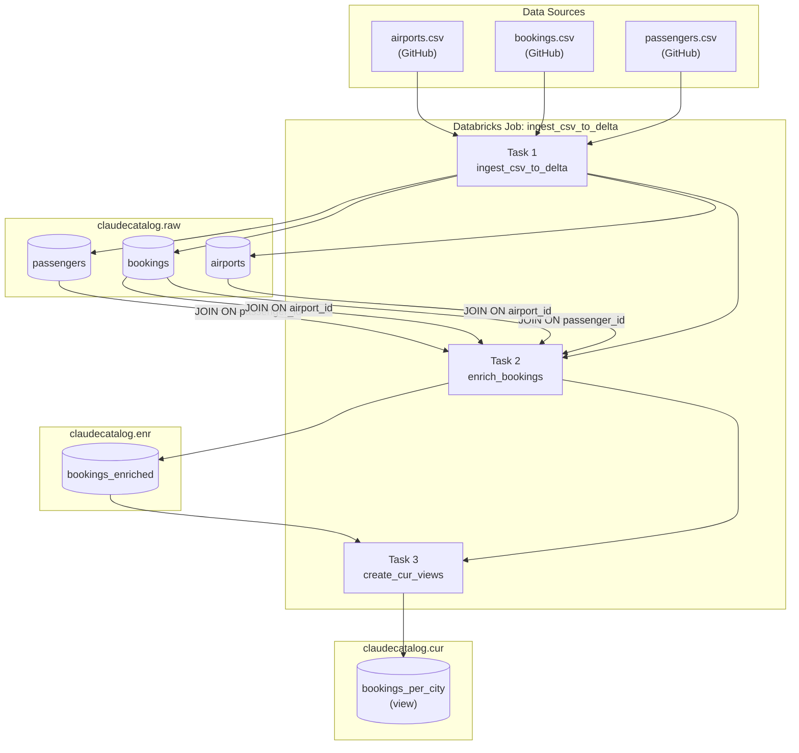

# Databricks Medallion Pipeline

An end-to-end data pipeline on Databricks Unity Catalog that ingests CSV data, enriches it through table joins, and exposes curated aggregation views — following the **raw → enriched → curated** medallion architecture.

---

## Architecture



---

## Layers

### `claudecatalog.raw` — Raw Layer
Ingested as-is from CSV source files. No transformations applied.

| Table | Description |
|---|---|
| `airports` | Airport reference data: `airport_id`, `airport_name`, `city`, `country` |
| `bookings` | Booking transactions: `booking_id`, `passenger_id`, `flight_id`, `airport_id`, `amount`, `booking_date` |
| `passengers` | Passenger profiles: `passenger_id`, `name`, `gender`, `nationality` |

### `claudecatalog.enr` — Enriched Layer
A single wide table created by joining all three raw tables.

| Table | Description |
|---|---|
| `bookings_enriched` | Bookings joined with passenger details (on `passenger_id`) and airport details (on `airport_id`) |

**Join logic:**
```sql
bookings
  LEFT JOIN passengers ON bookings.passenger_id = passengers.passenger_id
  LEFT JOIN airports   ON bookings.airport_id   = airports.airport_id
```

### `claudecatalog.cur` — Curated Layer
Aggregated views ready for reporting and dashboards.

| View | Description |
|---|---|
| `bookings_per_city` | Count of bookings per city, ordered by highest volume |

```sql
SELECT city, COUNT(booking_id) AS booking_count
FROM claudecatalog.enr.bookings_enriched
GROUP BY city
ORDER BY booking_count DESC
```

---

## Pipeline Scripts

| File | Task | Layer |
|---|---|---|
| `ingest_csv_to_delta.py` | `ingest_csv_to_delta` | raw |
| `enrich_bookings.py` | `enrich_bookings` | enr |
| `create_cur_views.py` | `create_cur_views` | cur |

Tasks run sequentially — each task depends on the previous one succeeding.

---

## Job: `ingest_csv_to_delta`

The pipeline is orchestrated as a single Databricks job with three sequential tasks:

```
ingest_csv_to_delta  →  enrich_bookings  →  create_cur_views
```

- Runs on **serverless compute**
- Each task uses `spark_python_task`
- Task 2 and 3 only run if the preceding task succeeds (`run_if: ALL_SUCCESS`)
