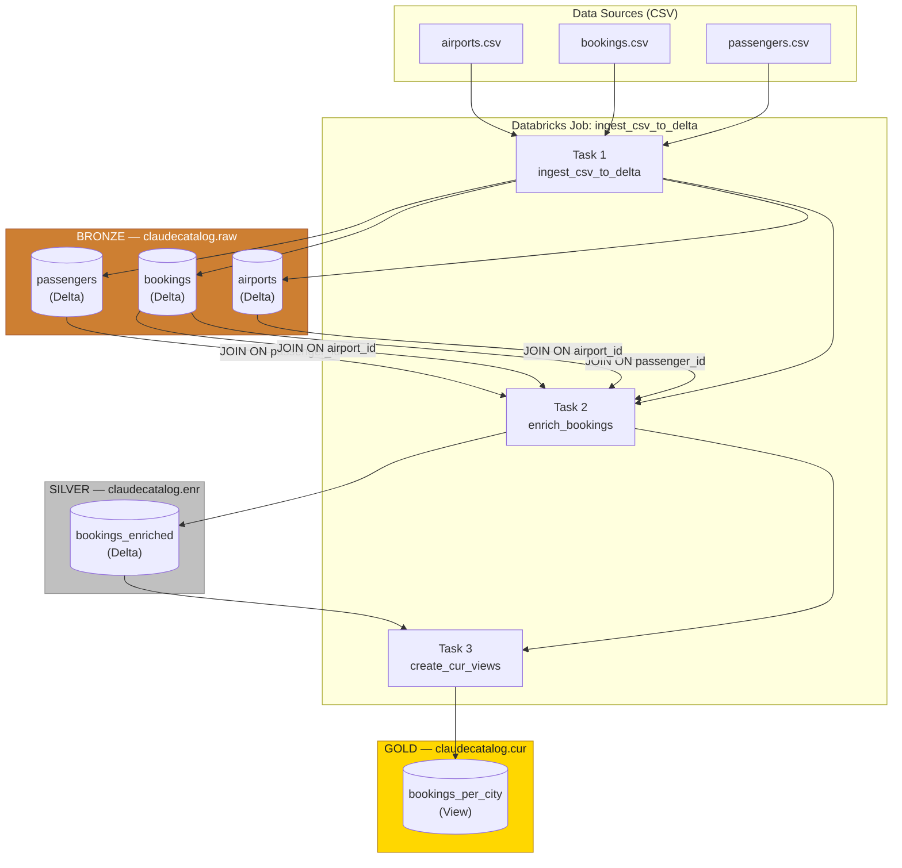

# Databricks Medallion Architecture Pipeline

An end-to-end data pipeline on Databricks Unity Catalog built on the **Medallion Architecture** — a layered approach that progressively refines raw data into trusted, analytics-ready assets across **Bronze → Silver → Gold** layers.

---

## Architecture



---

## Layers

### Bronze — `claudecatalog.raw`
Raw data landed directly from CSV sources into Delta tables. No transformations — data is preserved as-is for reprocessing and auditability.

| Table | Columns |
|---|---|
| `airports` | `airport_id`, `airport_name`, `city`, `country` |
| `bookings` | `booking_id`, `passenger_id`, `flight_id`, `airport_id`, `amount`, `booking_date` |
| `passengers` | `passenger_id`, `name`, `gender`, `nationality` |

### Silver — `claudecatalog.enr`
Cleaned and enriched layer. The three Bronze tables are joined into one wide table, resolving foreign keys into descriptive attributes.

| Table | Description |
|---|---|
| `bookings_enriched` | One big table — bookings enriched with passenger and airport details |

**Join logic:**
```sql
bookings
  LEFT JOIN passengers ON bookings.passenger_id = passengers.passenger_id
  LEFT JOIN airports   ON bookings.airport_id   = airports.airport_id
```

### Gold — `claudecatalog.cur`
Aggregated, business-ready layer. Views are optimised for reporting and dashboards — no raw joins required by consumers.

| View | Description |
|---|---|
| `bookings_per_city` | Total number of bookings per city, ordered by highest volume |

```sql
SELECT city, COUNT(booking_id) AS booking_count
FROM claudecatalog.enr.bookings_enriched
GROUP BY city
ORDER BY booking_count DESC
```

---

## Pipeline Scripts

| File | Task | Layer |
|---|---|---|
| `ingest_csv_to_delta.py` | `ingest_csv_to_delta` | Bronze |
| `enrich_bookings.py` | `enrich_bookings` | Silver |
| `create_cur_views.py` | `create_cur_views` | Gold |

---

## Job: `ingest_csv_to_delta`

Three sequential tasks — each layer only runs if the previous one succeeds.

```
ingest_csv_to_delta  →  enrich_bookings  →  create_cur_views
     (Bronze)              (Silver)              (Gold)
```

- Runs on **serverless compute**
- Each task uses `spark_python_task`
- Dependency: `run_if: ALL_SUCCESS`
